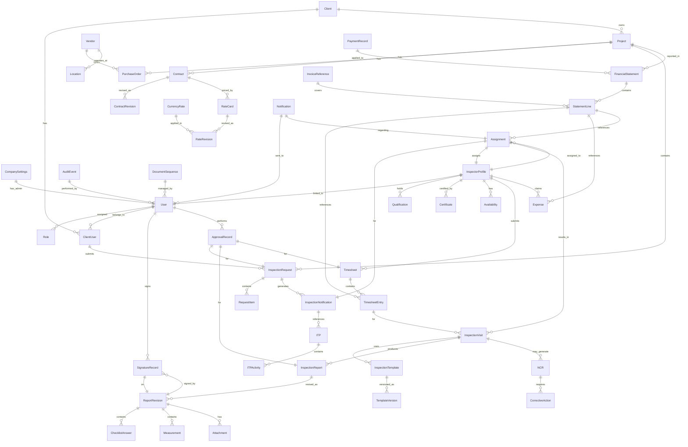

# Database Entity Relationship Diagram

## Core Entities

## Entity Summary

| Entity | Purpose |
|--------|---------|
| CompanySettings | Singleton configuration for the operating company |
| User | Authentication and identity for all platform users |
| Role | Configurable permission sets |
| Client | External client organizations |
| ClientUser | Client-side users mapped to clients |
| Project | Client-owned projects with unique codes |
| Contract | Legal and financial agreement with versioning |
| PurchaseOrder | Client or company purchase orders |
| Vendor | External vendors and manufacturers |
| Location | Inspection sites and factories |
| InspectionRequest | Client-submitted digital IRF |
| RequestItem | Line items within an inspection request |
| InspectionNotification | Generated notice for scheduling |
| ITP / ITPActivity | Inspection and Test Plan with intervention points |
| InspectorProfile | Extended profile for inspectors |
| Qualification / Certificate | Inspector competencies and expiry |
| Availability | Inspector calendar and scheduling |
| Assignment | Inspector-to-notification binding |
| InspectionVisit | Physical or remote inspection event |
| InspectionTemplate / TemplateVersion | Configurable dynamic form templates |
| InspectionReport / ReportRevision | Issued inspection reports with revision control |
| ChecklistAnswer / Measurement | Form response data |
| Attachment | Secure document and photo storage |
| Instrument | Calibrated equipment registry |
| NCR / CorrectiveAction | Nonconformity and remediation tracking |
| Timesheet / TimesheetEntry | Inspector time recording |
| Expense | Inspector and project expenses |
| RateCard / RateRevision | Versioned pricing rules |
| CurrencyRate | Exchange rate history |
| FinancialStatement / StatementLine | MTS financial output |
| InvoiceReference / PaymentRecord | Revenue tracking |
| SignatureRecord | Tamper-evident signature bindings |
| ApprovalRecord | Workflow approval audit |
| Notification | Communication events |
| AuditEvent | Immutable operation log |
| DocumentSequence | Controlled numbering |
