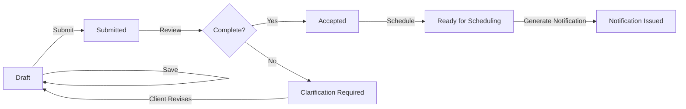
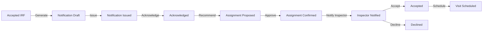
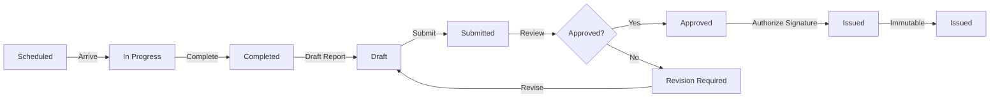
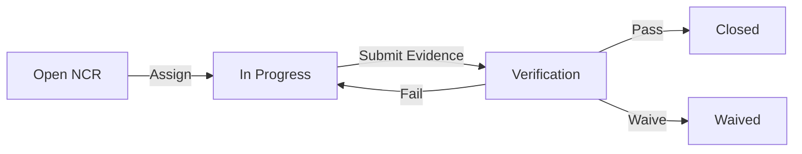
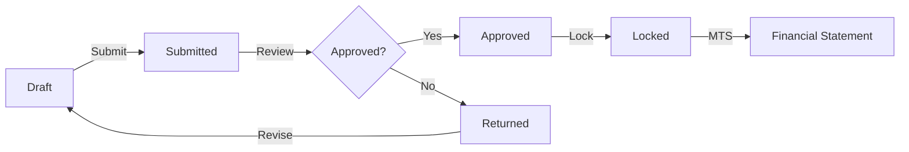
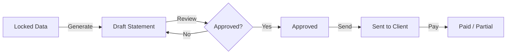
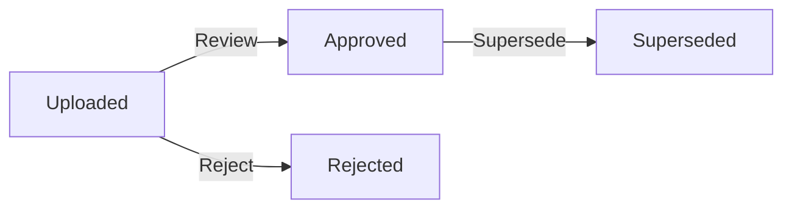

# Business Workflows

## 1. Client Request Submission Workflow

**States:** Draft → Submitted → Under Review → Clarification Required → Accepted → Ready for Scheduling

**Actors:** Client Requester, Client Approver, Inspection Coordinator

## 2. Inspection Notification and Assignment Workflow

**States:** Draft → Issued → Acknowledged → Assignment Proposed → Assignment Confirmed → Inspector Notified → Accepted / Declined → Visit Scheduled

**Actors:** Coordinator, Inspector, Vendor Representative

## 3. Inspection Visit and Report Workflow

**States:** Scheduled → In Progress → Completed → Draft → Submitted → Under Review → Revision Required → Approved → Issued

**Actors:** Inspector, Reviewer, Authorizer, Client Approver

## 4. NCR and Corrective Action Workflow

**States:** Open → In Progress → Verification → Closed / Waived

**Actors:** Inspector, Quality Manager, Vendor

## 5. Timesheet Approval Workflow

**States:** Draft → Submitted → Approved → Locked

**Actors:** Inspector, Coordinator, Finance Officer

## 6. Financial Statement Workflow

**States:** Draft → Approved → Sent → Paid / Partial

**Actors:** Finance Officer, Client Approver

## 7. Document Lifecycle

**States:** Uploaded → Approved → Superseded / Rejected

**Actors:** Coordinator, Technical Manager, Client

## 8. Role Dashboard Summary

| Role | Primary Dashboard |
|------|-------------------|
| System Administrator | System health, user management, audit logs |
| General Manager | Executive KPIs, project profitability, collection status |
| Technical Manager | Template library, ITP status, report quality metrics |
| Quality Manager | NCR dashboard, corrective action status, compliance metrics |
| Project Manager | Project timeline, assignments, client communications |
| Coordinator | Request queue, notifications, assignment pipeline |
| Inspector | My assignments, upcoming visits, timesheet status |
| Reviewer | Reports awaiting review, revision history |
| Client Admin | Client users, project list, request status |
| Client Requester | My requests, draft forms, document uploads |
| Client Approver | Pending approvals, issued reports |
| Vendor Rep | Acknowledgment queue, inspection schedule |
| Finance Officer | MTS, rate cards, statements, aging receivables |
| Auditor | Read-only access to all records, export capability |
